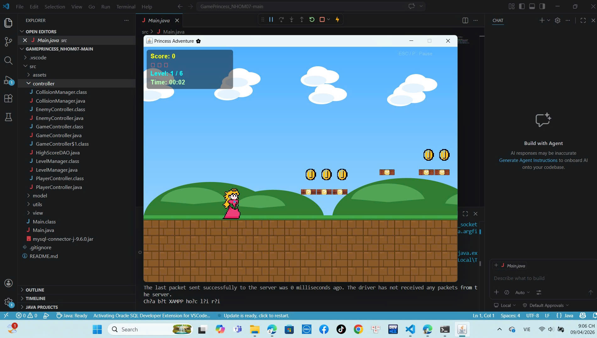
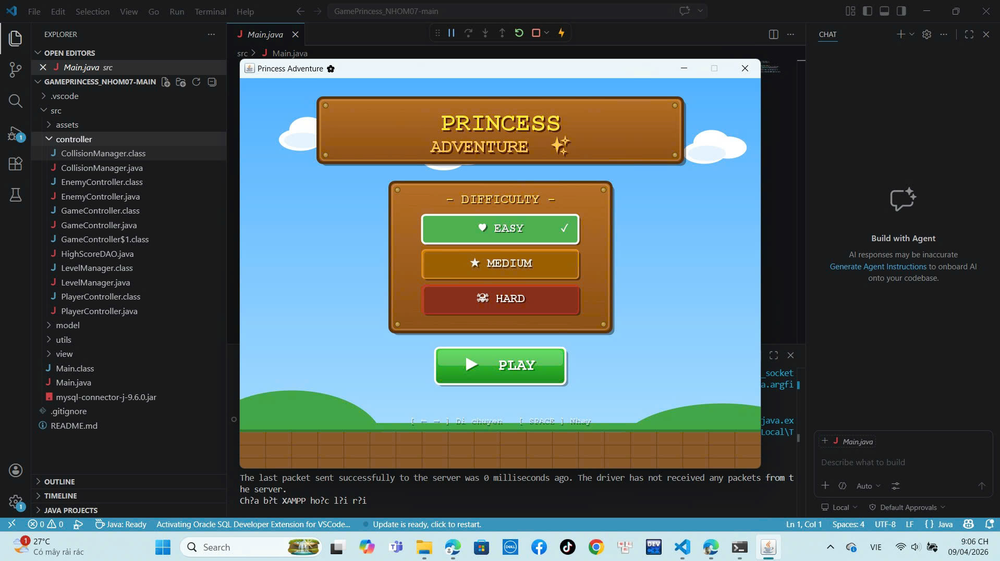
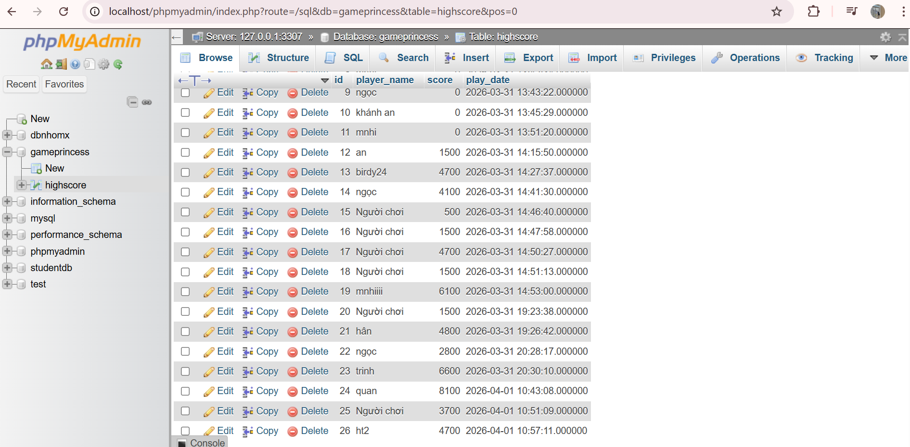

<<<<<<< HEAD
# GamePrincess_NHOM07
=======
# 👑 Game Princess - Nhóm 07
Bài tập lớn cuối kỳ môn Lập trình Java - Dự án Game 2D Desktop

👥 Thông tin nhóm (Team Members)
STT	Họ và Tên	Mã Sinh Viên	Vai trò / Nhiệm vụ	Link GitHub Cá Nhân
1	Hồ Thị Mai Nhi (Nhóm trưởng)	[3120225109]	Data & System Architect (Thiết kế cấu trúc Model, Quản lý tài nguyên Assets, Kết nối CSDL MySQL qua Utils/JDBC và Quản lý Git). Báo cáo[https://github.com/birdyy24]
2	Lê Hoàng Thảo Ngọc	[3120225099]	UI/UX Designer (Thiết kế giao diện View/Graphics, Renderer đồ họa, GUI Main và Hiệu ứng màn hình).	[https://github.com/lehoangthaongoc]
3	Trần Nguyễn Khánh An	[3120225004] Lead Game Logic (Xử lý Controller, Thuật toán va chạm, Logic trọng lực và Trạng thái Game). Báo cáo	[https://github.com/khnhhann]
📝 Giới thiệu dự án (Description)
Đây là trò chơi nhập vai 2D được xây dựng trên nền tảng Java Swing. Người chơi sẽ điều khiển nhân vật Công chúa vượt qua các chướng ngại vật là các ống cống và quái thú để tích lũy điểm số. Game hướng đến trải nghiệm giải trí nhẹ nhàng, rèn luyện sự khéo léo cho người chơi.

✨ Các chức năng chính (Features)
[x] Điều khiển nhân vật di chuyển và nhảy (Keyboard Interaction).

[x] Hệ thống xử lý va chạm thông minh (Collision Detection).

[x] Đồ họa 2D sống động với các lớp nhân vật và chướng ngại vật tự thiết kế.

[x] Tính toán và hiển thị điểm số trực tiếp khi vượt qua chướng ngại vật.

[x] Chức năng Restart nhanh chóng khi trò chơi kết thúc (Game Over logic).

💻 Công nghệ & Thư viện sử dụng (Technologies)
Ngôn ngữ: Java (JDK 17+)

Giao diện: Java Swing, AWT (Graphics2D)

Công cụ quản lý: Git, GitHub

IDE: Visual Studio Code / IntelliJ IDEA

📂 Cấu trúc thư mục (Project Structure)
 📦 src
  ┣ 📂 assets      # Hình ảnh nhân vật, vật phẩm, chướng ngại vật
  ┣ 📂 model       # Định nghĩa các thực thể (Player, Trophy, Enemy, GameState)
  ┣ 📂 view        # Xử lý đồ họa (Renderer), giao diện GamePanel, JFrame
  ┣ 📂 controller  # Bộ não điều khiển, xử lý phím bấm và va chạm
  ┣ 📂 utils       # Kết nối Database (JDBC), công cụ hỗ trợ
  ┗ 📜 Main.java   # File khởi chạy chính
🚀 Hướng dẫn cài đặt và chạy (Installation)
Clone repository này về máy:
git clone https://github.com/birdyy24/GamePrincess_NHOM07.git

Chạy ứng dụng:

Mở project bằng IntelliJ IDEA hoặc các Java IDE khác.

Đảm bảo thư mục assets nằm đúng vị trí cùng cấp với file thực thi để load được ảnh.

Chạy file Main.java để bắt đầu trải nghiệm.

📸 Ảnh chụp màn hình (Screenshots)
### 🖼️ Danh sách tài nguyên Game:

**1. Giao diện chính:**

**2. Menu Game:**

**3. Bảng thành tích :**

>>>>>>> 86adb76c0cf817e223444db146a9dadb5e9d3dd3
